# BTLSHPS: A Python Terminal battleships game

[Live Site](https://btlshps.herokuapp.com/)

## Overview

The player and computer make guesses (random in the computer's case) to try to hit the opponent's ships first, custom settings can be applied increasing or decreasing the number of ships on the grid, ships hit to win and a guess limit.

As a user I want to play battleships, I want it to work and be entertaining within its scope (how entertaining can a battleships game be?), I want clear instructions on how to play the game, and I want feedback on my actions.  The project has been developed with these objectives in mind.

## Table of Contents

## Features

### Intro
The player is greeted and made to feel welcome.  Instructions are clearly given and a choice can be made.
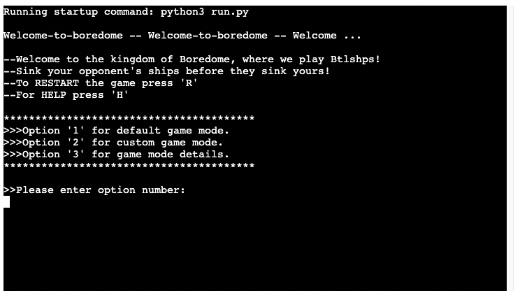

### Custom Settings
With the custom settings option the player can choose the number of ships, the number of hits to win and the total guesses allowed each.
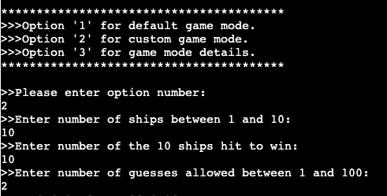

### Game Board
A board is displayed for the computer and the player.  The player's ships are visible while the computer's are not.  A witty pun is deployed.
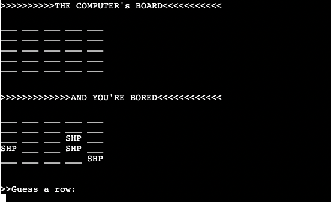

### Guessing
The player enters a guess for row and column in order to try and hit a hidden ship.  _X_ stands for a miss, ### for a hit and SHP is a ship which has not yet been hit.  The player can figure this out from context or press 'H' for help, which is up to them.

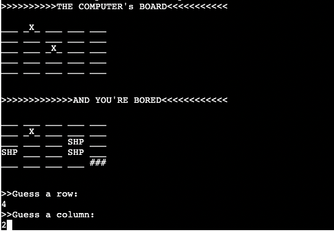

If they do not enter a number they are prompted to retry...

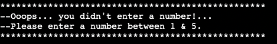

If they did not enter a number between the correct range of 1 and 5 they are prompted accordingly...

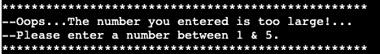

If they already guessed the co-ordinates they are made to retry, duplicates are not accepted...

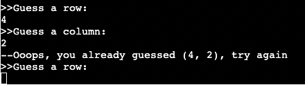

A successful guess is followed by a random computer guess, and the board is updated... a game log with the results is printed above the updated board.

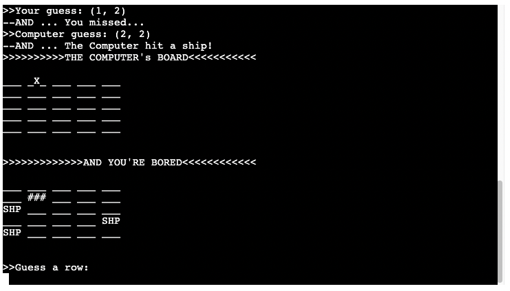

### Help
The player can access help by pressing 'H' as instructed at the start of the game.  Upon pressing 'H' in-game the following info-block is printed:

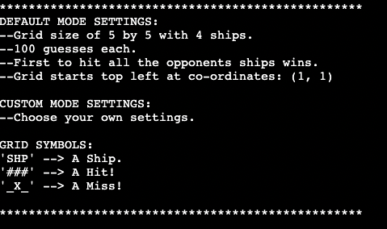

### Game Over
The player can either win, lose or draw.  Drawing is only possible if there is a custom guess limit reached while both player and computer have hit the same number of ships each.  Below the final score there is an option to either start a new game or to quit.

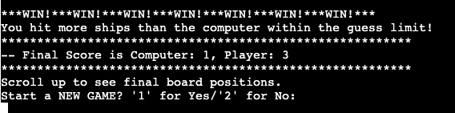

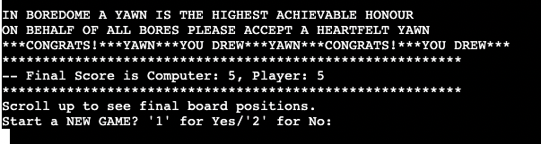

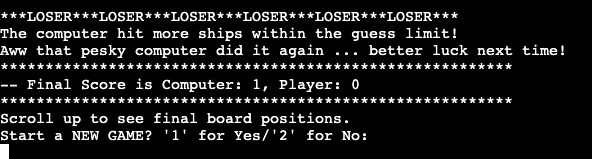

## Game Logic Overview
### Game Start and Choosing Settings
'main()' is initiated and calls 'game_start_options()' which prints the greeting and presents the player with three options.  
 - Option 1 returns '1' to main() which creates the computer and player class instances with default settings.  
  - Option 2 returns '2' to main() which calls custom_settings() and allows the player to choose number of ships, hits to win and total guesses allowed before game over. Player and computer intances are assigned the custom settings.
  - Option 3 prints out help_me() and prompts the player again to make a choice.
  - Once a choice has been made main() calls the generate_ships() class method on player and computer intances and then calls game_loop().

### Game Loop
 - The game loop starts by printing the boards using the print_screen() function. While the 'new_turn' variable is equal to 'True' the loop calls the player_guess() class method prompting the player to input guess co-ordinates, guesses are saved in a class array.  
 - With win_conditions() the co-ordinates are then checked against ship locations, hits to win etc.  If win conditions are met it sets 'new_turn' to 'False' which will end the game_loop().  If win conditions are not met it returns 'True' and the game continues by calling computer_guess() and generating a random computer guess which follow the same checks as the player guess.
 - After both guesses are made and 'new_turn' still equals 'True' a game log with guess results is printed along with a board with updated symbols representing a miss or a hit as appropriate.
 - If win conditions are met a fitting message will be printed to the player along with a final board showing the computer ship locations and the final scores.  The player will be prompted to hit '1' for a new game or '2' to close the program.

## Technologies Used

 - Code: [Python 3.8.11](https://www.python.org/)
 - [Git](https://git-scm.com/) - for version control.
 - [Github](https://github.com/) - repository to store the project files and host/share the project.
 - [Heroku](https://www.heroku.com/platform) - to deploy the simulated python terminal environment in which the file executes. 

## Testing

Python PEP8 Validator - All right.

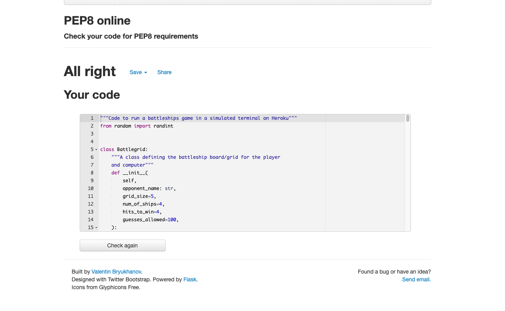

## Deployment
### Heroku
[How Heroku Works](https://www.heroku.com/platform#platform-diagram-detail)
## Credits
Thanks to Brian Macharia for his help through-out. Thanks to Code institute for the learning materials. Thanks to various YouTube creators for inspiration.